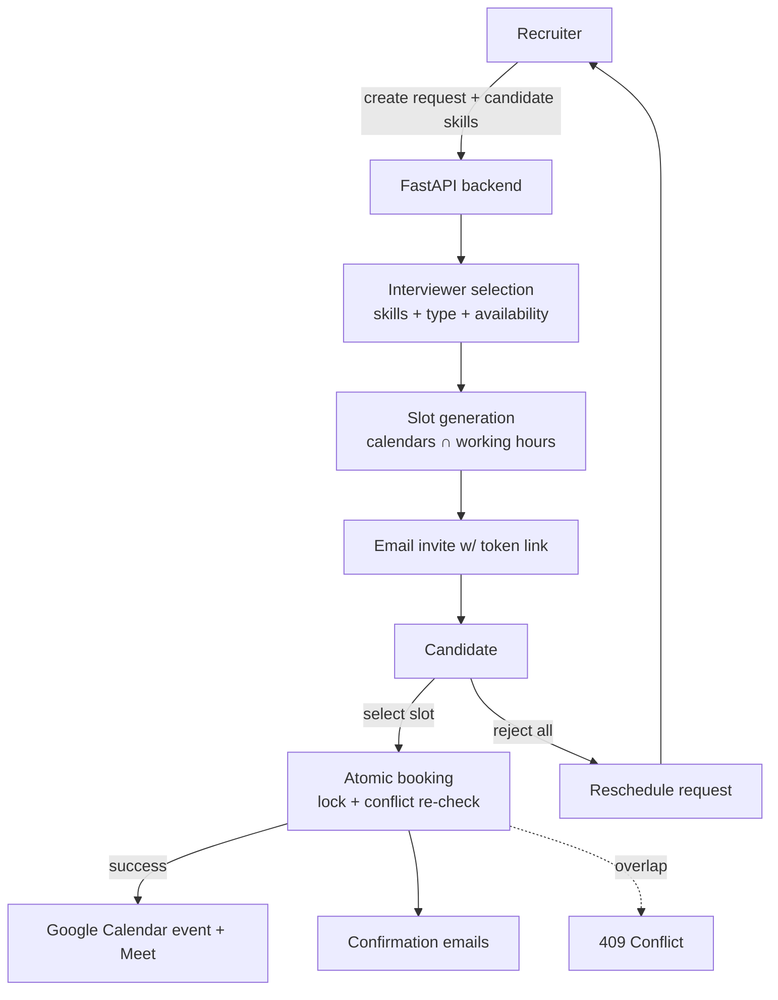

# Smart Interview Scheduler

A full-stack platform that automates interview coordination between **recruiters**, **candidates**, and **interviewers/panelists**. A recruiter creates an interview request; the system recommends suitable interviewers from candidate skills and availability, generates mutually-free time slots from panelist calendars, lets the candidate self-book (or request a reschedule) via a secure link, prevents double-booking of a panelist, and sends email notifications and a Google Calendar invite.

It considers candidate skills, interview type, interviewer expertise, interviewer availability, existing calendar events, interview duration, working hours, and scheduling conflicts.

> **AI transparency:** AI (Llama 3.1 via Groq) is used **only** for two non-critical helpers — ranking already-valid slots and drafting invitation email copy. **Interviewer selection and conflict prevention are fully deterministic** (plain Python), so scheduling decisions are predictable, testable, and explainable. Both AI calls have deterministic fallbacks and never receive free-form user text as instructions.

---

## Key Features

### Authentication & RBAC
- **Staff login** (`POST /auth/login`) validates credentials and returns a **JWT** (HS256). Passwords are hashed with `pbkdf2_sha256` (passlib).
- Two staff roles: **admin** and **recruiter**. Candidates do **not** log in.
- Authorization is **enforced server-side** via FastAPI dependencies (`require_staff`, `require_admin`) — frontend route guards are convenience only.
- `401` = not authenticated / bad token; `403` = authenticated but wrong role. The role is read from the signed token/DB, never from the request body.
- Default seeded accounts on first boot: `admin@demo.com / admin123`, `recruiter@demo.com / recruiter123` (override via `SEED_*` env vars).

### Candidate workflow (no login required)
Candidates interact through a single-use, expiring **tokenized link** (`/availability/{token}`), scoped to their own interview:
- View proposed slots (rendered in a timezone they choose).
- Select preferred slot(s) → the best-ranked one is booked.
- Or **reject all slots and request a reschedule** with an optional reason.

### Recruiter workflow
1. Log in and (as admin) register panelists with their skills.
2. Create an interview request: candidate details + skills, job title, round type, duration, buffer, and a date window.
3. Optionally click **Recommend** to rank panelists by skill match + availability.
4. On submit, the backend validates panelists, generates slots, and emails the candidate a link.
5. Candidate books (or reschedules); booking is confirmed atomically.
6. Calendar event + confirmation emails are triggered.

### Intelligent Interviewer Selection
Deterministic and explainable — **no LLM is used for this**. Implemented in `backend/app/services/matching_service.py` and exposed via `POST /panelists/recommend`.

- **Candidate skills** come from the `Candidate.skills` field (entered on the request form).
- **Panelist skills** come from the `Panelist.skills` field.
- Skills are **normalized** so aliases match (e.g. `React` / `ReactJS` / `React.js` → `react`; `ML` → `machine learning`; `Postgres` → `postgresql`).
- **Score** = matched skills ÷ total candidate skills (a value in `0.0–1.0`).
- **Interview type** influences the explanation: for `technical` rounds skill overlap is the primary factor; other rounds emphasize eligibility.
- **Availability overrides skill:** each panelist is checked against their calendar for the window; an unavailable panelist always ranks below every available one.
- Response includes `match_score`, `matched_skills`, `available`, and a human-readable `reason` (e.g. *"Matches 3 of 4 candidate skills for the technical interview."*).

### Intelligent Scheduling
Implemented in `backend/app/services/scheduling_service.py`:
- Reads each required panelist's **busy blocks** from Google Calendar (or treats them as free if no calendar is connected).
- Inverts busy → free, **intersects** all panelists' free time, clips to **working hours (09:00–18:00, weekdays)** in the interview's timezone, then splits into discrete slots of the requested **duration + buffer**.
- Returns up to 20 candidate slots; the top 10 are persisted and ranked.

### Double-Booking Prevention
Implemented in `backend/app/services/booking_service.py`. A panelist can never hold two overlapping **confirmed** interviews.

```
Existing confirmed:  10:00 – 11:00
New request:         10:30 – 11:30   → overlap → 409 Conflict (rejected)
New request:         11:00 – 12:00   → no overlap → allowed
```

- Overlap rule: `existing_start < new_end AND existing_end > new_start`.
- Booking is **atomic**: the panelist rows are locked (`SELECT … FOR UPDATE`), the conflict is **re-validated under the lock against live data**, then the booking is inserted and committed — so a slot is never trusted just because it appeared free earlier.
- On conflict the API returns **`409`** with `"The selected time slot is no longer available for this panelist."`; the existing booking is never overwritten and no calendar event is created.

> The `FOR UPDATE` row lock serializes concurrent bookings for the same panelist on PostgreSQL. On SQLite (used for tests/local) writers are serialized by the engine. A DB-level exclusion constraint is not used because a panelist relates to a booking indirectly (via a JSON id list + a separate slot table).

### Rescheduling
```
Candidate reviews proposed slots
        → rejects all → "Request reschedule" (+ optional reason)
        → interview status = rescheduling; recruiter + panelists notified by email
        → recruiter clicks "Propose New Slots" (recomputes fresh slots, new link)
        → candidate selects a new slot → same atomic conflict validation → booked
```
- Token-scoped: a candidate can only reschedule **their own** interview.
- The optional reason is persisted (`InterviewRequest.reschedule_reason`).
- Candidate skills, interview type, and interview identity are preserved across reschedule.

### Email Notifications
Sent via **Resend** (`backend/app/services/notification_service.py`). Events: interview **invitation**, booking **confirmation**, **cancellation**, and **reschedule request**.

- **Recipients are resolved dynamically** from application data (candidate/recruiter/panelist emails on the DB records) — never hardcoded and never taken from an env variable.
- Environment configures the **sender/provider only** (`RESEND_API_KEY`, `RESEND_FROM_EMAIL`).
- Send failures are surfaced to the caller (return `False` + `NotificationLog.status = "failed"`), and logs never contain credentials.

### Calendar Integration
Google Calendar API via OAuth2 (`backend/app/services/calendar_service.py`):
- Panelists connect their Google Calendar through an OAuth flow.
- Free/busy is read to compute availability.
- After a booking is committed, an event with a **Google Meet link** is created and attendees are added.
- If event creation fails, the booking remains valid and no event is created (no automatic retry).

---

## System Overview



---

## Technology Stack

| Layer | Technologies |
|---|---|
| **Frontend** | Next.js 14 (App Router), React 18, TypeScript, Tailwind CSS, Axios, react-hot-toast, date-fns / date-fns-tz |
| **Backend** | Python, FastAPI, SQLAlchemy 2.0, Pydantic v2 |
| **Auth** | JWT (python-jose, HS256), passlib (`pbkdf2_sha256`) |
| **Database** | PostgreSQL (production) · SQLite (tests/local) |
| **AI (assistive only)** | Groq API → Llama 3.1 (slot ranking + email drafting) |
| **Email** | Resend |
| **Calendar** | Google Calendar API + Google Meet (OAuth2) |
| **Testing** | pytest + FastAPI TestClient |

---

## Project Structure

```
SmartInterviewSystem/
├── backend/
│   ├── app/
│   │   ├── api/v1/         # Routes: auth, interviews, panelists, availability, bookings, notifications
│   │   ├── core/           # config, database, security (hashing/JWT), auth (RBAC deps)
│   │   ├── models/         # SQLAlchemy: user, candidate, panelist, interview, availability_slot, booking, notification_log
│   │   ├── schemas/        # Pydantic request/response models
│   │   ├── services/       # scheduling, booking (conflict), matching (selection), notification, calendar, ai, token
│   │   └── main.py         # App entrypoint; creates tables + seeds staff on startup
│   ├── tests/              # pytest suites (rbac, interviews, email, conflict, reschedule, selection)
│   ├── requirements.txt    # runtime deps
│   └── requirements-dev.txt# test deps (pytest, email-validator)
└── frontend/
    ├── app/                # Next.js routes: login, requests, requests/new, requests/[id],
    │                       #   panelists, analytics, availability/[token], confirm/[token]
    ├── components/         # layout (Sidebar/TopBar), ui, auth (AuthGuard)
    └── lib/                # api client (axios + JWT), auth helpers, utils
```

---

## Authentication & Authorization Flow

```
Login (email + password) → credentials verified → JWT issued (sub, role, email)
   → frontend stores token → sent as "Authorization: Bearer <token>"
   → backend decodes token → loads user → role check → protected resource
```
Candidate endpoints use an unguessable, expiring **link token** instead of a login.

---

## API Overview

All staff endpoints require `Authorization: Bearer <jwt>`. Candidate endpoints require a valid link token in the path/body.

**Auth**
| Method | Path | Purpose | Access |
|---|---|---|---|
| POST | `/api/v1/auth/login` | Log in, receive JWT | Public |
| GET | `/api/v1/auth/me` | Current user | Staff |

**Interviews**
| Method | Path | Purpose | Access |
|---|---|---|---|
| POST | `/api/v1/interviews` | Create request (generates slots, emails candidate) | Staff |
| GET | `/api/v1/interviews` | List requests | Staff |
| GET | `/api/v1/interviews/{id}` | Get request | Staff |
| POST | `/api/v1/interviews/{id}/resend-invite` | Resend candidate link | Staff |
| POST | `/api/v1/interviews/{id}/propose-slots` | Recompute slots after reschedule | Staff |
| DELETE | `/api/v1/interviews/{id}` | Cancel | Staff |

**Panelists**
| Method | Path | Purpose | Access |
|---|---|---|---|
| GET | `/api/v1/panelists` | List | Staff |
| POST | `/api/v1/panelists` | Create | Admin |
| POST | `/api/v1/panelists/recommend` | Rank panelists by skill + availability | Staff |
| GET | `/api/v1/panelists/{id}/calendar-auth-url` | Start Google OAuth | Admin |
| GET | `/api/v1/panelists/calendar-callback` | OAuth callback | Public (Google redirect) |

**Availability (candidate, token-based)**
| Method | Path | Purpose |
|---|---|---|
| GET | `/api/v1/availability/candidate/{token}` | Fetch interview + proposed slots |
| POST | `/api/v1/availability/candidate/submit` | Select slot(s) → atomic booking |
| POST | `/api/v1/availability/candidate/reschedule` | Reject all slots, request reschedule |

**Bookings**
| Method | Path | Purpose | Access |
|---|---|---|---|
| POST | `/api/v1/bookings` | Book a slot (atomic, conflict-checked) | Staff |
| GET | `/api/v1/bookings/confirm/{token}` | Booking details by confirm token | Public |
| POST | `/api/v1/bookings/{id}/cancel` | Cancel booking | Staff |

Interactive docs: `http://localhost:8000/docs`.

---

## Environment Configuration

Backend `.env` (see `backend/.env.example`). **Never commit real values.**

| Variable | Purpose | Secret | Required |
|---|---|---|---|
| `DATABASE_URL` | DB connection (Postgres, or `sqlite:///./app.db`) | – | Yes |
| `SECRET_KEY` | JWT signing key | Yes | Yes |
| `GOOGLE_CLIENT_ID` / `GOOGLE_CLIENT_SECRET` | Google OAuth app | Yes | Yes (for calendar) |
| `GOOGLE_REDIRECT_URI` | OAuth callback URL | – | Yes (for calendar) |
| `GROQ_API_KEY` | Groq (slot ranking + email text) | Yes | Yes* |
| `RESEND_API_KEY` | Resend email provider | Yes | Yes* |
| `RESEND_FROM_EMAIL` | **Sender** address | – | Yes |
| `FRONTEND_URL` / `BACKEND_URL` | Base URLs (links, CORS) | – | Yes |
| `TOKEN_EXPIRY_HOURS` | Candidate link lifetime (default 72) | – | No |
| `SEED_ADMIN_EMAIL` / `SEED_ADMIN_PASSWORD` / `SEED_RECRUITER_EMAIL` / `SEED_RECRUITER_PASSWORD` | Override seeded staff accounts | Yes | No |

\* AI ranking and email sending fail gracefully if keys are absent (fallback ranking / logged failure), but are needed for full functionality.

`RESEND_FROM_EMAIL` configures **only the sender**. Recipient (candidate/recruiter/panelist) emails come from the database — there is intentionally **no recipient email env variable**.

Frontend `.env.local` (see `frontend/.env.local.example`): `NEXT_PUBLIC_API_URL` (defaults to `http://localhost:8000/api/v1`).

---

## Installation & Setup

**Requirements:** Python 3.11+ and Node.js 18+.

**Backend**
```bash
cd backend
cp .env.example .env          # fill in values
python -m venv .venv && source .venv/bin/activate
pip install -r requirements.txt
uvicorn app.main:app --reload --port 8000
```
Tables are created automatically on startup (SQLAlchemy `create_all`), and default staff users are seeded. Alembic is configured for future migrations, but no migration versions are committed — you do **not** need to run `alembic upgrade` for a fresh database.

**Frontend**
```bash
cd frontend
cp .env.local.example .env.local
npm install
npm run dev
```

- Backend: `http://localhost:8000` (docs at `/docs`)
- Frontend: `http://localhost:3000`

---

## Testing

Backend tests use pytest + FastAPI `TestClient` against an isolated SQLite database (no live external calls).

```bash
cd backend
pip install -r requirements.txt -r requirements-dev.txt
python -m pytest tests/ -q
```

Coverage highlights (43 tests):
- **Email** — recipient resolved dynamically, no recipient env var, provider failure returns failure (not false success), credentials never logged.
- **Conflicts** — exact/partial/containing overlaps rejected, adjacent/non-overlapping allowed, second candidate blocked, `409` from the API, existing booking never overwritten.
- **Reschedule** — candidate can request reschedule, cannot touch another's interview, reason persisted, recruiter notified, propose-slots preserves skills + round type.
- **Selection** — skill-match ranking (A > C > B), alias normalization, availability overrides skill, recommend API returns scores/reason, invalid panelist rejected.
- **Auth/RBAC** — unauthenticated `401`, wrong role `403`, role cannot be spoofed via request body.

---

## End-to-End Flow

**Happy path**
1. Recruiter logs in and creates an interview request (candidate + skills, round type, window).
2. Backend validates panelists, recommends by skill/availability, and generates slots.
3. Candidate receives an email with a secure link.
4. Candidate selects a slot; backend locks the panelist, re-validates, and books atomically.
5. Google Calendar event + Meet link created; confirmation emails sent to all parties.

**Reschedule path**
1. Candidate rejects all proposed slots and submits a reschedule request (+ reason).
2. Interview moves to `rescheduling`; recruiter and panelists are emailed.
3. Recruiter proposes new slots (fresh link issued); candidate picks one.
4. The same atomic conflict validation runs before the new booking is confirmed.

---

## Important Design Decisions

- **Backend-authoritative authorization** — RBAC and identity are enforced on the server; the frontend cannot bypass it, and roles come from the signed token, not request bodies.
- **Dynamic email recipients** — recipients are always resolved from DB records; environment holds sender/provider config only.
- **Find vs. book are separated** — slots are advisory; availability is re-checked at booking time, so a stale slot list can't cause a bad booking.
- **Atomic, conflict-checked booking** — panelist rows are locked and overlap is re-validated inside the transaction before commit.
- **Deterministic interviewer matching** — predictable, explainable skill overlap with availability as a hard override; no LLM in the decision path.
- **Rescheduling is an explicit state** (`rescheduling`) with its own notifications and slot-regeneration step.

---

## Security Considerations

- JWT-based authentication; passwords hashed with `pbkdf2_sha256`.
- Role-based access control on every staff endpoint (`401`/`403` distinguished).
- Candidate access via single-use, expiring, unguessable link tokens scoped to one interview.
- Pydantic validation + input sanitization on request bodies.
- Secrets live in environment variables; credentials are never logged.
- Double-booking prevented at the service/transaction layer.

---

## Example: Intelligent Interviewer Selection

```
Candidate skills: Python, FastAPI, Machine Learning, PostgreSQL   (4 skills)
Interview type:   Technical

Panelist A: Python, FastAPI, Machine Learning   → matches 3/4 → score 0.75
Panelist C: Python, SQL                         → matches 1/4 → score 0.25
Panelist B: Java, Spring Boot                   → matches 0/4 → score 0.00
```
Ranking: **A > C > B** (score = matched ÷ total candidate skills). If Panelist A were unavailable for the window, an available lower-scoring panelist would be ranked ahead of A, since availability overrides skill.

---

## Known Limitations / Future Improvements

- **Concurrency** is guaranteed via row locks on PostgreSQL; there is no cross-process DB exclusion constraint (SQLite serializes writers for tests/local).
- **Reminder emails**: a reminder template exists but automatic reminder scheduling is not wired up (`apscheduler` is available but unused).
- **Calendar**: single provider (Google); a failed event creation is not automatically retried.
- **Skill normalization** uses a small alias map — broader synonym/taxonomy support would improve matching.
- **Panel assembly**: `recommend` ranks individual panelists; it does not auto-assemble a multi-person conflict-free panel.
- **Candidate skills** are recruiter-entered; there is no resume parsing.
- **Timezone** handling covers slot display and working hours (09:00–18:00); it is not per-panelist configurable.

---

## Hackathon Value Proposition

The system removes the manual back-and-forth of interview scheduling: it recommends the right interviewer from candidate skills and real availability, finds mutually free times from live calendars, lets candidates self-serve booking or rescheduling through a secure link, and guarantees no panelist is double-booked — all behind server-enforced role-based access and automatic, correctly-addressed email notifications.
